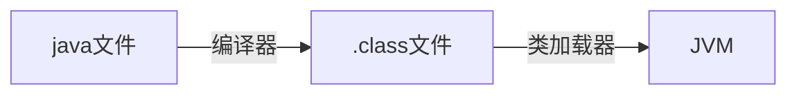

# 零、导言

我们知道，我们写的java文件是不能直接运行的，我们可以在IDEA中右键文件名点击运行，这中间其实掺杂了一系列的复杂处理过程。这篇文章，我们只讨论我们的代码在运行之前的一个环节，叫做类的加载。按照我写文章的常规惯例，先给出这篇文章的大致结构；

一、认识类加载机制，

二、详细介绍类加载的过程，

三、类加载器，双亲委派机制。


# 一、什么是类的加载

类的加载机制在整个java程序运行期间处于一个什么环节，下面使用一张图来表示：




从上图可以看，java文件通过编译器变成了.class文件，接下来类加载器又将这些.class文件加载到JVM中。其中**类装载器**的**作用**其实就是类的加载。今天我们要讨论的就是这个环节。

## 类的加载的概念：

其实可以一句话来解释：类的加载指的是将类的.class文件中的二进制数据读入到内存中，将其放在运行时数据区的方法区内，然后在堆区创建一个 java.lang.Class对象，用来封装类在方法区内的数据结构。

到现在为止，我们基本上对类加载机制处于整个程序运行的环节位置，还有类加载机制的概念有了基本的印象。在类加载.class文件之前，还有两个问题需要我们去弄清楚：

## 1、在什么时候才会启动类加载器？

其实，类加载器并不需要等到某个类被“首次主动使用”时再加载它，JVM规范允许类加载器在预料某个类将要被使用时就预先加载它，如果在预先加载的过程中遇到了.class文件缺失或存在错误，类加载器必须在程序首次主动使用该类时才报告错误（LinkageError错误）如果这个类一直没有被程序主动使用，那么类加载器就不会报告错误。

## 2、从哪个地方去加载.class文件

在这里进行一个简单的分类。例举了5个来源

（1）本地磁盘

（2）网上加载.class文件（Applet）

（3）从数据库中

（4）压缩文件中（ZAR，jar等）

（5）从其他文件生成的（JSP应用）

有了这个认识之后，下面就开始讲讲，类加载机制了。首先看的就是类加载机制的过程。

# **二、类加载的过程**

类从被加载到虚拟机内存中开始，到卸载出内存为止，它的整个生命周期包括：加载、验证、准备、解析、初始化、使用和卸载七个阶段。它们的顺序如下图所示：


其中**类加载的过程包括了加载、验证、准备、解析、初始化五个阶段**。在这五个阶段中，加载、验证、准备和初始化这四个阶段发生的顺序是确定的，而解析阶段则不一定，它在某些情况下可以在初始化阶段之后开始。另外注意这里的几个阶段是按顺序**开始**，而不是按顺序**进行**或**完成**，因为这些阶段通常都是互相交叉地混合进行的，通常在一个阶段执行的过程中调用或激活另一个阶段。

下面就一个一个去分析一下这几个过程。

## 1、加载

”加载“是”类加机制”的第一个过程，在加载阶段，虚拟机主要完成三件事：

（1）通过一个类的全限定名来获取其定义的二进制字节流

（2）将这个字节流所代表的的静态存储结构转化为方法区的运行时数据结构

（3）在堆中生成一个代表这个类的Class对象，作为方法区中这些数据的访问入口。

相对于类加载的其他阶段而言，加载阶段是可控性最强的阶段，因为程序员可以使用系统的类加载器加载，还可以使用自己的类加载器加载。我们在最后一部分会详细介绍这个类加载器。在这里我们只需要知道类加载器的作用就是上面虚拟机需要完成的三件事，仅此而已就好了。

## 2、验证

验证的主要作用就是**确保被加载的类的正确性**。也是连接阶段的第一步。说白了也就是我们加载好的.class文件不能对我们的虚拟机有危害，所以先检测验证一下。他主要是完成四个阶段的验证：

### （1）文件格式的验证：

验证.class文件字节流是否符合class文件的格式的规范，并且能够被当前版本的虚拟机处理。这里面主要对魔数、主版本号、常量池等等的校验（魔数、主版本号都是.class文件里面包含的数据信息、在这里可以不用理解）。

### （2）元数据验证：

主要是对字节码描述的信息进行语义分析，以保证其描述的信息符合java语言规范的要求，比如说验证这个类是不是有父类，类中的字段方法是不是和父类冲突等等。

### （3）字节码验证：

这是整个验证过程最复杂的阶段，主要是通过数据流和控制流分析，确定程序语义是合法的、符合逻辑的。在元数据验证阶段对数据类型做出验证后，这个阶段主要对类的方法做出分析，保证类的方法在运行时不会做出威海虚拟机安全的事。

### （4）符号引用验证：

它是验证的最后一个阶段，发生在虚拟机将符号引用转化为直接引用的时候。主要是对类自身以外的信息进行校验。目的是确保解析动作能够完成。

对整个类加载机制而言，验证阶段是一个很重要但是非必需的阶段，如果我们的代码能够确保没有问题，那么我们就没有必要去验证，毕竟验证需要花费一定的的时间。当然我们可以使用-Xverfity:none来关闭大部分的验证。

## 3、准备

**准备阶段主要为类变量分配内存并设置初始值**。这些内存都在方法区分配。在这个阶段我们只需要注意两点就好了，也就是类变量和初始值两个关键词：

（1）类变量（static）会分配内存，但是实例变量不会，实例变量主要随着对象的实例化一块分配到java堆中，

（2）这里的初始值指的是数据类型默认值，而不是代码中被显示赋予的值。比如

public static int value = 1; //在这里准备阶段过后的value值为0，而不是1。赋值为1的动作在初始化阶段。

当然还有其他的默认值。


注意，在上面value是被static所修饰的准备阶段之后是0，但是如果同时被final和static修饰准备阶段之后就是1了。我们可以理解为static final在编译器就将结果放入调用它的类的常量池中了。

## 4、解析

解析阶段主要是虚拟机将常量池中的**符号引用转化为直接引用**的过程。什么是符号应用和直接引用呢？

### 符号引用：

以一组符号来描述所引用的目标，可以是任何形式的字面量，只要是能无歧义的定位到目标就好。

举个栗子：在班级中，老师可以用张三来代表你，也可以用你的学号来代表你，但无论任何方式这些都只是一个代号（符号），这个代号指向你（符号引用）

### 直接引用：

直接引用是可以指向目标的指针、相对偏移量或者是一个能直接或间接定位到目标的句柄。和虚拟机实现的内存有关，不同的虚拟机直接引用一般不同。解析动作主要针对类或接口、字段、类方法、接口方法、方法类型、方法句柄和调用点限定符7类符号引用进行。

举个栗子：通过你的地址、身份证、手机，直接找到你

## 5、初始化

这是类加载机制的最后一步，在这个阶段，java程序代码才开始真正执行。我们知道，在准备阶段已经为类变量赋过一次值。在初始化阶端，程序员可以根据自己的需求来赋值了。一句话描述这个阶段就是执行类构造器< clinit >()方法的过程。

在初始化阶段，主要为类的静态变量赋予正确的初始值，JVM负责对类进行初始化，主要对类变量进行初始化。在Java中对类变量进行初始值设定有两种方式：

①声明类变量时指定初始值

②使用静态代码块为类变量指定初始值

# 三、JVM初始化步骤

1、假如这个类还没有被加载和连接，则程序先加载并连接该类

2、假如该类的直接父类还没有被初始化，则先初始化其直接父类

3、假如类中有初始化语句，则系统依次执行这些初始化语句

# 四、类初始化时机

只有当对类的主动使用的时候才会导致类的初始化，类的主动使用包括以下六种：

- 创建类的实例，也就是new的方式

- 访问某个类或接口的静态变量，或者对该静态变量赋值

- 调用类的静态方法

- 反射（如 Class.forName(“com.shengsiyuan.Test”)）

- 初始化某个类的子类，则其父类也会被初始化

- Java虚拟机启动时被标明为启动类的类（ JavaTest），直接使用 java.exe命令来运行某个主类

  


# 五、类加载器

虚拟机设计团队把加载动作放到JVM外部实现，以便让应用程序决定如何获取所需的类。

## 1、Java自带的三个类加载器:

### Bootstrap ClassLoader ：

最顶层的加载类，主要加载核心类库，也就是我们环境变量下面`%JRE_HOME%\lib`下的`rt.jar`、`resources.jar`、`charsets.jar`和`class`等。另外需要注意的是可以通过启动 jvm 时指定 `-Xbootclasspath`和路径来改变`Bootstrap ClassLoader`的加载目录。比如`java -Xbootclasspath/a:path`被指定的文件追加到默认的`bootstrap`路径中。我们可以打开我的电脑，在上面的目录下查看，看看这些jar包是不是存在于这个目录。

### Extention ClassLoader ：

扩展的类加载器，加载目录`%JRE_HOME%\lib\ext`目录下的 jar 包和 class 文件。还可以加载`-D java.ext.dirs`选项指定的目录。

### Application ClassLoader：

也称为`SystemAppClass`。 加载当前应用的`classpath`的所有类。我们看到`java`为我们提供了三个类加载器，应用程序都是由这三种类加载器互相配合进行加载的，如果有必要，我们还可以加入自定义的类加载器。这三种类加载器的加载顺序是什么呢？

**Bootstrap ClassLoader > Extention ClassLoader > Appclass Loader**

一张图来看一下他们的层次关系


代码验证一下：


从上面的结果可以看出，并没有获取到`Extention ClassLoader`（扩展类加载器）的父Loader，原因是`Bootstrap Loader`（引导类加载器）是用C语言实现的，找不到一个确定的返回父Loader的方式，于是就返回null。

## 2、类加载的三种方式

认识了这三种类加载器，接下来我们看看类加载的三种方式。

（1）通过命令行启动应用时由 JVM 初始化加载含有`main()`方法的主类。

（2）通过`Class.forName()`方法动态加载，会默认执行初始化块`（static{}）`，但是`Class.forName(name,initialize,loader)`中的`initialze`可指定是否要执行初始化块。

（3）通过`ClassLoader.loadClass()`方法动态加载，不会执行初始化块。

下面代码来演示一下

```java
// 首先我们定义一个FDD类
public class FDD {
    static { 
        System.out.println("我是静态代码块。。。。"); 
    }
}

// 然后我们看一下如何去加载
package com.fdd.test;
public class FDDloaderTest { 
    public static void main(String[] args) throws ClassNotFoundException { 
        ClassLoader loader = HelloWorld.class.getClassLoader(); 
        System.out.println(loader); 
        
        // 一、 使用ClassLoader.loadClass()来加载类，不会执行初始化块 
        loader.loadClass("Fdd"); 
        // 二、 使用Class.forName()来加载类，默认会执行初始化块 
        Class.forName("Fdd"); 
        // 三、使用Class.forName()来加载类，指定ClassLoader，初始化时不执行静态块 
        Class.forName("Fdd", false, loader); 
    }
}
```


## 3、双亲委派机制

他的工作流程是： 当一个类加载器收到类加载任务，会**先交给其父类加载器去完成**，因此最终加载任务都会传递到顶层的启动类加载器，只有当父类加载器无法完成加载任务时，才会尝试执行加载任务。

举个栗子：张三有七个苹果，不会自己直接吃掉，会先问哥哥姐姐吃不吃，哥哥姐姐问爸爸妈妈吃不吃，爸爸妈妈再问爷爷奶奶吃不吃。如果爷爷奶奶吃了两个，爸爸妈妈吃两个，哥哥姐姐吃两个，剩下的一个才自己吃。如下图：


```sequence
Title: 标题：双亲委派栗子
张三 -> 哥哥姐姐:你们吃苹果吗？(剩下7个苹果)
哥哥姐姐 -> 爸爸妈妈:你们吃苹果吗？(剩下7个苹果)
爸爸妈妈 -> 爷爷奶奶:你们吃苹果吗？(剩下7个苹果)

Note right of 爷爷奶奶: 吃了两个苹果
Note right of 爸爸妈妈: 吃了两个苹果
Note right of 哥哥姐姐: 吃了两个苹果

爷爷奶奶 --> 爸爸妈妈: 我们吃完了(剩下5个苹果)
爸爸妈妈 --> 哥哥姐姐: 我们吃完了(剩下3个苹果)
哥哥姐姐 --> 张三: 我们吃完了(剩下1个苹果)

Note right of 张三: 嘻嘻，还有一个苹果

```


采用**双亲委派机制**可以避免重复加载，父类已经加载了，子类就不需要再次加载更加安全，很好的解决了各个类加载器的基础类的统一问题，如果不使用该种方式，那么用户可以随意定义类加载器来加载核心api，会带来相关隐患。

## 4、自定义类加载器

两种方式

（1）遵守双亲委派模型：继承`ClassLoader`，重写`findClass()`方法。

（2）破坏双亲委派模型：继承`ClassLoader`,重写`loadClass()`方法。 

通常我们推荐采用第一种方法自定义类加载器，最大程度上的遵守双亲委派模型。

我们看一下实现步骤

（1）创建一个类继承`ClassLoader`抽象类

（2）重写`findClass()`方法

（3）在`findClass()`方法中调用`defineClass()`

代码实现一下：

```java
public class MyClassLoader extends ClassLoader {
    private String libPath; 
    public DiskClassLoader(String path) { 
        libPath = path; 
    }
    
    @Override  
    protected Class<?> findClass(String name) throws ClassNotFoundException { 
        String fileName = getFileName(name); 
        File file = new File(libPath,fileName); 
        try { 
            FileInputStream is = new FileInputStream(file); 
            ByteArrayOutputStream bos = new ByteArrayOutputStream(); 
            int len = 0; 
            try { 
                while ((len = is.read()) != -1) {
                    bos.write(len); 
                } 
            } catch (IOException e) { 
                e.printStackTrace();
            } 
            byte[] data = bos.toByteArray(); 
            is.close();
            bos.close(); 
            return defineClass(name,data,0,data.length); 
        } catch (IOException e) { 
            e.printStackTrace(); 
        } 
        return super.findClass(name); 
    } 
    
    //获取要加载 的class文件名 
    private String getFileName(String name) { 
        int index = name.lastIndexOf('.'); 
        if(index == -1){ 
            return name+".class";
        }else{ 
            return name.substring(index+1)+".class";
        } 
    }
}
```


接下来我们就可以自己去加载类了，使用方法大体就是两行

```java
MyClassLoader diskLoader = new MyClassLoader("D:\\lib");
//加载class文件，注意是com.fdd.Test
Class c = diskLoader.loadClass("com.fdd.Test");
```


参考：[Java类加载机制，你理解了吗？](<https://baijiahao.baidu.com/s?id=1636309817155065432&wfr=spider&for=pc>)

